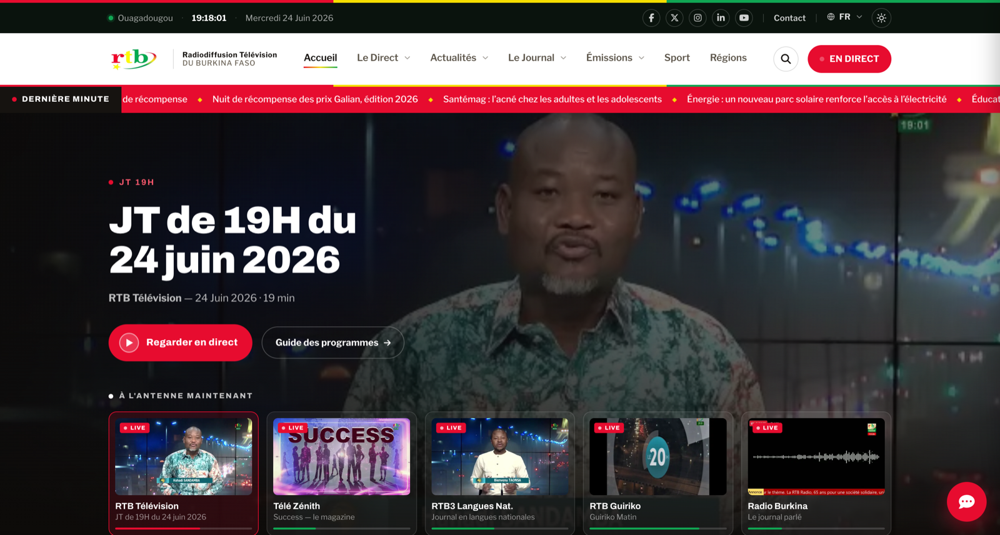

# RTB — Thème & extensions WordPress

Thème WordPress de la **Radiodiffusion Télévision du Burkina (RTB)** : moderne, rapide et
accessible, accompagné de quatre extensions (recherche instantanée, assistant de contenu,
SEO, édition en direct).

> Ce dépôt contient le **thème et les extensions** — pas le cœur de WordPress
> (déjà open source). Voir [Démarrage rapide](#démarrage-rapide-tout-inclus-cœur-wordpress-compris).



---

## Sommaire
- [Aperçu](#aperçu)
- [Fonctionnalités](#fonctionnalités)
- [Pré-requis](#pré-requis)
- [Démarrage rapide](#démarrage-rapide-tout-inclus-cœur-wordpress-compris)
- [Installation sur un WordPress existant](#installation-sur-un-wordpress-existant)
- [Configuration](#configuration)
- [Internationalisation](#internationalisation-multilingue)
- [Structure du dépôt](#structure-du-dépôt)
- [Les extensions](#les-extensions)
- [Déploiement](#déploiement)
- [Contribuer](#contribuer)
- [Licence](#licence)

---

## Aperçu
- **Stack** : WordPress (PHP 8.1+), Alpine.js (auto-hébergé), CSS à design-tokens, Font Awesome auto-hébergé.
- **Aucune dépendance CDN** pour le JS/CSS critique : tout est servi depuis le serveur.
- **Multilingue** prêt (Polylang) : français + langues nationales (mooré, dioula, fulfuldé, gulmancéma) + anglais.
- **Accessibilité** soignée et **performances** élevées (cache de page côté serveur, images via CDN d'images, préchargement LCP).

## Fonctionnalités
- Page d'accueil dynamique : hero vidéo, « Le Journal », « Nos Antennes », « À la Une », radio.
- **Le Direct** TV (flux par chaîne) + **Radio** en ligne, gérables depuis l'admin, avec repli vidéo.
- **Replays / émissions** (JT 13H/19H/20H, magazines) avec lecture vidéo.
- Articles + **documents PDF** (comptes rendus du Conseil des ministres) lus dans la page et indexés pour la recherche.
- **Mode sombre**, responsive mobile/tablette, page À propos éditable en direct.

## Pré-requis
- WordPress **7.0+**
- PHP **8.1+** (8.3 recommandé) avec `mbstring`
- MySQL/MariaDB
- *(optionnel)* `poppler-utils` (`pdftotext`) pour extraire le texte des PDF
- *(optionnel)* [Polylang](https://wordpress.org/plugins/polylang/) pour le multilingue (fonctionne aussi sans)

## Démarrage rapide « tout inclus » (cœur WordPress compris)
Le cœur WordPress n'est **pas stocké** dans ce dépôt (il est déjà open source), mais il est
**récupéré automatiquement** à l'installation — deux façons, sans configuration manuelle :

**A. Docker (recommandé)** — site complet en une commande :
```bash
git clone https://github.com/onassgroupe/rtb-wordpress-theme && cd rtb-wordpress-theme
docker compose up -d
# → http://localhost:8080   (admin / admin) — cœur WP + thème + extensions + Polylang déjà actifs
```

**B. WP-CLI (sans Docker)** — télécharge le cœur, installe et active tout :
```bash
git clone https://github.com/onassgroupe/rtb-wordpress-theme && cd rtb-wordpress-theme
DB_USER=root DB_PASS=secret bash install-full.sh
# → crée ./rtb-site (WordPress complet) avec le thème + extensions actifs
```

> Ces deux scripts installent aussi **Polylang** automatiquement (dépendance tierce non incluse).

## Installation sur un WordPress existant
Sur un site WordPress déjà en place, greffez le thème et les extensions dans `wp-content/`.

```bash
cd votre-site/wp-content
git clone https://github.com/onassgroupe/rtb-wordpress-theme rtb-src

# Lier (dev) ou copier (prod) le thème, les plugins et les mu-plugins
ln -s "$(pwd)/rtb-src/wp-content/themes/rtb"              themes/rtb
ln -s "$(pwd)/rtb-src/wp-content/plugins/rtb-search"      plugins/rtb-search
ln -s "$(pwd)/rtb-src/wp-content/plugins/rtb-chat"        plugins/rtb-chat
ln -s "$(pwd)/rtb-src/wp-content/plugins/rtb-seo"         plugins/rtb-seo
ln -s "$(pwd)/rtb-src/wp-content/plugins/onass-live-edit" plugins/onass-live-edit
cp    rtb-src/wp-content/mu-plugins/*.php                 mu-plugins/
```

Puis, avec WP-CLI : `bash wp-content/rtb-src/setup.sh` (active thème + extensions, installe
Polylang, crée les langues, rafraîchit les permaliens). Ou manuellement dans **wp-admin** :
activer le thème **RTB**, puis **RTB Search**, **RTB Assistant**, **RTB SEO**, **Onass Live Edit**,
enregistrer les permaliens, puis **Outils → Assistant RTB → Apprendre le contenu**.

## Configuration
- **Contenus & identité** : `Apparence → Personnaliser → RTB` (contact, réseaux, ticker, hero, radio, À propos…).
- **Direct / Radio** : champs sur les fiches *Antenne* et *Station* (URL de flux, repli vidéo).
- **Assistant** : `Outils → Assistant RTB → Apprendre le contenu` (construit le lexique de correction des fautes de frappe).
- **Variables d'environnement** : copier `.env.example` → `.env` (voir [docs/DEPLOY.md](docs/DEPLOY.md)).

## Internationalisation (multilingue)
Le code est **prêt pour le multilingue** : chaînes traduisibles, CPT/taxonomies traductibles,
sélecteur de langue. **Sans aucun plugin, le site fonctionne en français** (aucune erreur).

Pour activer la bascule de langues, installer **Polylang** — gratuit, *non inclus dans ce dépôt
car c'est une extension tierce* (avec son propre dépôt et ses mises à jour) :
```bash
wp plugin install polylang --activate
```
Puis dans **Langues** (wp-admin) :
1. Créer les langues : Français (défaut), English, Mooré (`mos`), Dioula (`dyu`), Fulfuldé (`ff`), Gulmancéma (`gux`).
2. **Langues → Traductions des chaînes** → traduire le groupe « RTB Thème ».
3. Traduire les articles / émissions par langue.

> Le thème détecte automatiquement Polylang (appels protégés par `function_exists`) : présent, il
> active le multilingue ; absent, il reste en français sans planter.

## Structure du dépôt
```
wp-content/
├── themes/rtb/            Thème principal (templates, assets, inc/)
├── plugins/
│   ├── rtb-search/        Moteur de recherche (pertinence + instantané)
│   ├── rtb-chat/          Assistant de contenu (100 % local)
│   ├── rtb-seo/           SEO (OpenGraph, JSON-LD, hreflang…)
│   └── onass-live-edit/   Édition en direct via le Customizer
└── mu-plugins/            Cache de page, /login propre, récupération admin
deploy/                    Dockerfile, docker-compose, config (déploiement Coolify)
docs/                      Installation, déploiement, architecture
```

## Les extensions
| Extension | Rôle | POO |
|---|---|---|
| **rtb-search** | Recherche pondérée (titre > corps), tolérante pluriels/accents, **instantanée** au fil de la frappe, analytics tendances. | ✅ |
| **rtb-chat** | Assistant qui répond **à partir du contenu du site** (recherche, résumé extractif, direct, programmes) — entièrement local, sans service externe. | ✅ |
| **rtb-seo** | Meta/canonical/robots, Open Graph, Twitter Cards, JSON-LD (NewsArticle, VideoObject, Organization, fil d'Ariane), hreflang. | ✅ |
| **onass-live-edit** | Édition inline des contenus via le Customizer WordPress. | — |

Détails techniques : [docs/ARCHITECTURE.md](docs/ARCHITECTURE.md).

## Déploiement
Exemple complet (Docker + Coolify) dans [docs/DEPLOY.md](docs/DEPLOY.md) et le dossier `deploy/`.

## Contribuer
Les contributions sont bienvenues — voir [CONTRIBUTING.md](CONTRIBUTING.md).

## Licence
[GPL-2.0-or-later](LICENSE) — comme WordPress. Font Awesome est sous ses propres licences
(SIL OFL 1.1 pour les polices, MIT pour le code).
